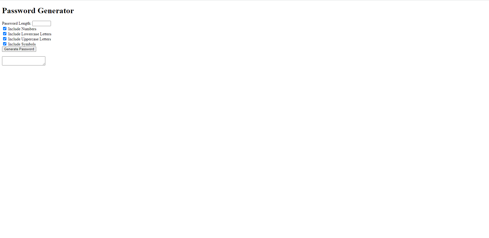
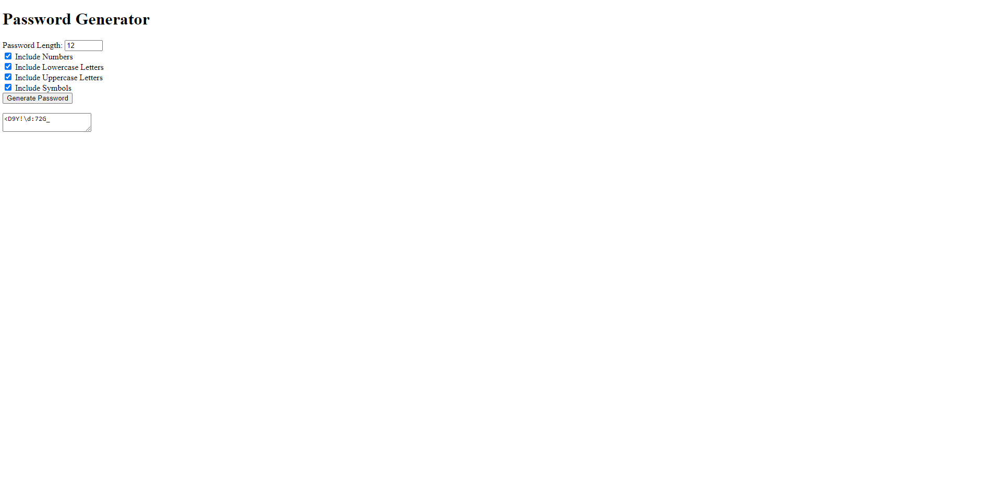

# Password Generator
A password generator that asks if you want to include letters (upper & lower), symbols, and numbers

## Description

caption: screenshot before clicking submit
 

 
caption: screenshot after clicking submit
 

 

## Installation
N/A
## Usage
Go to the following URL:

## Credits
Karen Peazzoni: https://github.com/kpeazzoni/UTA-JS-Challenge-3
## License
Please refer to the LICENSE in the repo.

